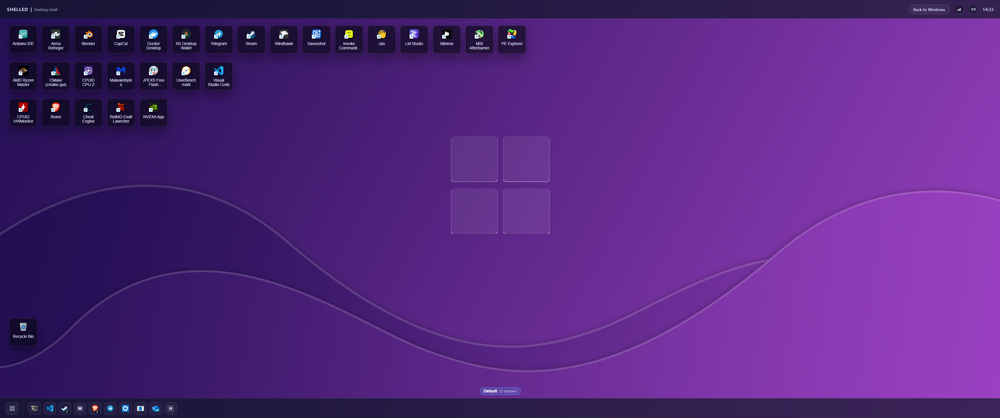

# Shelled – Modern Desktop Environment for Windows 11



Shelled is a **modern desktop environment replacement for Windows 11**.  
Instead of skinning or theming the existing shell, Shelled replaces `explorer.exe`
with a native backbone plus a fully web-based desktop UI.

The goal is to give Windows the kind of separation you expect on Linux:
a small, testable core that talks to the OS, and a flexible HTML/CSS/JS
environment that defines everything the user sees and interacts with.

> ⚠️ Shelled is experimental and can completely replace the normal Windows desktop.
> If you are not comfortable recovering from a broken shell, use the **safe test
> mode** below and keep Explorer as your main shell.

---

## Quick Start for Non‑technical Users

If you just want to *try* Shelled and see what it looks like, start here.
You do **not** need to edit the registry or replace Explorer for this.

### What you need

- Windows 11
- .NET 8 Desktop Runtime (or SDK)
- WebView2 runtime (usually already installed on Windows 11)

You can either download a prebuilt package (from the GitHub Releases page, if
available) or build it yourself using the instructions in the **Development**
section further down.

### Option 1 – Try Shelled safely (recommended)

This runs Shelled **on top of** your existing desktop:

- Explorer keeps running in the background.
- No registry keys are changed.
- You can always close Shelled and go back to normal Windows.

1. Build or download Shelled  
   If you are building from source:
   ```powershell
   cd path\to\shelled
   dotnet build -c Release
   ```
   After a successful build, `myshell-bootstrap.exe` will usually be in  
   `src\Shell.Bootstrap\bin\Release\net8.0-windows7.0\myshell-bootstrap.exe`.

2. Open PowerShell in the folder that contains `myshell-bootstrap.exe`.

3. Start Shelled in **development mode** (safe mode that never touches the shell):
   ```powershell
   $env:SHELL_DEV_MODE = "1"
   .\myshell-bootstrap.exe
   ```

4. A full-screen desktop will appear with Shelled’s taskbar, launcher and
   workspace strip. Explorer is still running underneath; you can:
   - Use `Alt+Tab` to switch back to other windows.
   - Close the `myshell-bootstrap.exe` console window to exit Shelled.

5. If something looks wrong or the UI glitches:
   - Press `Ctrl+Shift+Esc` to open **Task Manager**.
   - Use **File → Run new task** and type `explorer.exe` to bring the normal
     desktop to the front.

This mode is the safest way to see whether you like Shelled without changing
how Windows starts.

### Option 2 – Run Shelled as your real shell (Winlogon)

This makes Shelled start **instead of Explorer** when you sign in.
Only do this if you are comfortable with Windows recovery tools.

**Strongly recommended before you begin:**

- Create a separate local user account (for example `ShelledTest`) and use
  that account for your first experiments.
- Keep `docs/Recovery.md` open on another device so you can follow the
  recovery steps even if your desktop is broken.
- Keep at least one administrator account that still uses the normal Windows
  desktop.

#### 1. Build a Release build

If you have not already:

```powershell
cd path\to\shelled
dotnet build -c Release
```

After that, the bootstrap executable should be here (or similar):

- `src\Shell.Bootstrap\bin\Release\net8.0-windows7.0\myshell-bootstrap.exe`

Make a note of the **full absolute path** to `myshell-bootstrap.exe`
(for example `C:\Users\You\shelled\src\Shell.Bootstrap\bin\Release\net8.0-windows7.0\myshell-bootstrap.exe`).

#### 2. Register Shelled as the shell for one user

Shelled is designed to register itself as a **per-user** shell using the
registry key:

- `HKEY_CURRENT_USER\Software\Microsoft\Windows NT\CurrentVersion\Winlogon\Shell`

To point that value at `myshell-bootstrap.exe` for the currently logged-in
user:

1. Sign in as your **test** user (not your main daily account).
2. Open **PowerShell as administrator**.
3. Run the following, replacing the path with your actual bootstrap path:

   ```powershell
   $shellKey = 'HKCU:\Software\Microsoft\Windows NT\CurrentVersion\Winlogon'
   $exePath  = 'C:\full\path\to\myshell-bootstrap.exe'

   if (-not (Test-Path $shellKey)) {
     New-Item -Path $shellKey -Force | Out-Null
   }

   Set-ItemProperty -Path $shellKey -Name Shell -Value $exePath
   ```

4. Sign out and sign back in as the same user. Windows should now start
   Shelled instead of Explorer.

> Note: In *normal shell mode* you should **not** set `SHELL_DEV_MODE` or
> `SHELL_TEST_MODE`. Those modes are only for safe testing and deliberately
> prevent permanent shell changes.

#### 3. Getting back to Explorer

If you want to go back to the default Windows desktop, you have several
options:

- **Fast way (panic command)**  
  1. Press `Ctrl+Shift+Esc` to open **Task Manager**.  
  2. Use **File → Run new task** and browse to `myshell-bootstrap.exe`.  
  3. Run it with the panic switch:
     ```powershell
     myshell-bootstrap.exe --panic
     ```
     This tries to restore the Winlogon `Shell` registry value to
     `explorer.exe` and then launches Explorer.

- **Manual way (registry)**  
  1. From Task Manager, run `regedit`.  
  2. Go to `HKEY_CURRENT_USER\Software\Microsoft\Windows NT\CurrentVersion\Winlogon`.  
  3. Set `Shell` to `explorer.exe` (or delete the value).  
  4. Sign out and sign back in.

For more detailed recovery scenarios (Safe Mode, fixing another user profile,
etc.) see `docs/Recovery.md`.

---

## Overview

Conceptually Shelled has four layers, implemented by several projects:

- **Shell Core (`Shell.Core`)**  
  Pure domain logic with no Win32 calls. Tracks windows, workspaces, tray icons,
  hotkeys, and overall shell state.

- **OS Adapters (`Shell.Adapters.Win32`)**  
  The only place that talks to the Windows API. Implements:
  - `IWindowSystem` – window enumeration, visibility, focus
  - `IProcessLauncher` – launching apps
  - `ITrayHost` – system tray hosting
  - `IHotkeyRegistry` – global hotkeys
  - `ISystemEventHandler` – shutdown / logoff events

- **Core Hosting & Bootstrap (`Shell.Service`, `Shell.Bootstrap`, `Shell.Bootstrap.Infrastructure`)**  
  Long-running core service, shell entrypoint executable, and shell-registration utilities.

- **UI Host & Web Desktop (`Shell.Bridge.WebView`, `Shell.UI.Web`)**  
  Borderless WebView2 host plus an HTML/CSS/JS desktop environment.

Everything above the adapters is cross-platform in principle; Windows 11 is
the primary runtime because of WebView2 and the Win32 shell APIs.

### Solution layout

Current top-level projects:

- `src/Shell.Core` – core models, events, configuration, and `ShellCore` state machine.
- `src/Shell.Adapters.Win32` – Win32 implementations of shell interfaces.
- `src/Shell.Service` – `ShellCoreService` hosting core + adapters + UI host.
- `src/Shell.Bridge.WebView` – `ShellUiHost` WebView2 app and JS bridge.
- `src/Shell.Bootstrap` – `myshell-bootstrap.exe` entrypoint used as the Winlogon shell.
- `src/Shell.Bootstrap.Infrastructure` – shared bootstrap utilities (for example `ShellRegistration`).
- `src/Shell.UI.Web` – web desktop (HTML/CSS/JS) and its tests.
- `tests/Shell.Tests` – core + adapter + UI host unit/integration tests.
- `tests/Shell.Bootstrap.Tests` – bootstrap / shell registration tests.
- `tests/Shell.Service.Tests` – service lifecycle tests.

---

## What Shelled Provides on Windows 11

- **Custom Desktop Environment**
  - Modern, web-rendered shell surface (taskbar, panels, launcher, tray).
  - Workspace-centric workflow instead of a single global taskbar.

- **Virtual Workspaces**
  - Internal workspace model managed by the core.
  - Windows are assigned to workspaces; switching a workspace hides/shows
    windows via the window system adapter.

- **App Launcher**
  - Web-driven launcher overlay (similar to a start menu / app grid).
  - Application metadata and launch definitions live in core configuration.

- **Tray Integration**
  - Native tray host window receives `Shell_NotifyIcon` messages.
  - Core maintains a tray model; Web UI renders it and forwards clicks.

- **Hotkeys & System Events**
  - Global hotkeys (e.g. for launcher or workspace switching).
  - Clean handling of shutdown and logoff so the shell exits gracefully.

---

## Development

### Prerequisites

- Windows 11 (WebView2 and shell APIs).
- .NET 8 SDK.
- Node.js (for UI tests).
- Visual Studio 2022 or VS Code.

### Build & Test (Native)

```powershell
dotnet restore
dotnet build
dotnet test
```

The test suite includes:

- Core unit tests (pure domain logic).
- Adapter integration tests (Win32, but safe-mode aware).
- Service / bootstrap tests.

### UI Development & Tests

From `src/Shell.UI.Web`:

```bash
npm install
npm test
```

The UI tests include:

- State/store unit tests.
- DOM-level integration tests with a fake core.
- E2E-style tests using `node:test` + `jsdom` for:
  - Launcher behavior and app launch wiring.
  - Workspace switching UI (`TEST-E2E-02`).
  - Tray icon rendering and click routing (`TEST-E2E-03`).

---

## Status & Roadmap

Current state:

- Core, adapters, service, bootstrap, and WebView host are implemented.
- Web UI provides a functional shell surface (taskbar, launcher, workspaces, tray).
- Safety features and test-mode behavior are in place.

Next steps:

- Polish the desktop experience for daily-driver use on Windows 11.
- Expand configuration and theming options for the web UI.
- Iterate on performance and resource usage.

If you’re interested in running a modern, web-powered desktop environment
on Windows 11, Shelled is the experimental playground to do it. Contributions,
issues, and ideas are welcome.

